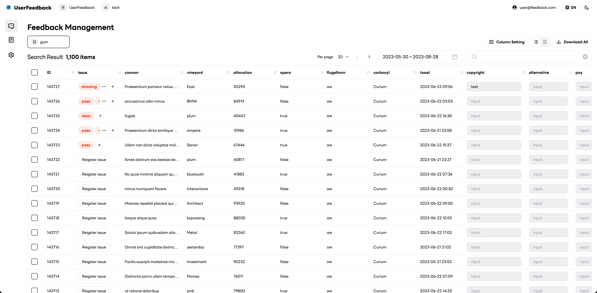

<p align="center">
    
    <h1 align="center">ABC User Feedback</h1>
</p>

ABC User Feedback is a standalone web application that manages Voice of Customer (VoC) data. It allows you to gather and sort feedback from your customers. We ABC Studio are using it to millions users services. 

<p align="center">
    
</p>

# Features

ABC User Feedback provides the following features:

- You can customize the data fields to match your questionnaire.
- You can assign tags to each feedback to categorize them by topic.
- The Issue feature has a status indicator that lets you use it as a simple issue tracker. You can also link each issue to a ticket in your own issue tracker system.
- Role Based Access Control (RBAC)
- Admin UI with an attractive dashboard.

# Getting Started

Our backend is built with NestJS and our frontend is built with NextJS. We provide Docker images for fast and easy setup. 

## 1. Official Docker Image Installation

### [web](https://hub.docker.com/r/line/abc-user-feedback-web)

```
docker pull line/abc-user-feedback-web
```

### [api](https://hub.docker.com/r/line/abc-user-feedback-api)

```
docker pull line/abc-user-feedback-api
```

## 2. Development Environment (Local)

Alternatively you can set up a local development environment.

### System Requirements

:bulb: Before you begin, make sure you have the following installed:

#### Required

- [Node.js v18 or above](https://nodejs.org/en/download/)
- [Docker](https://docs.docker.com/desktop/)
- [MySQL v8](https://www.mysql.com/downloads/)

#### Optional

- SMTP - for mail verification during making accounts
- [OpenSearch v7](https://opensearch.org/) - for performance on searching feedbacks

You can use [docker-compose.infra.yml](./docker-compose.infra.yml) file for requirements.

### Getting Started With Local Development

ABC User Feedback is using a monorepo (powered by [TurboRepo](https://turbo.build/)) with multiple apps and packages.

Follow these simple instructions to set up a local development environment.

1. Clone the repository and install dependencies:

```bash
git clone https://github.com/line/abc-user-feedback
cd abc-user-feedback
yarn install
```

2. Spin up all required infrastructure (Mysql, Opensearch, etc.) using Docker Compose:

```bash
docker-compose -f docker-compose.infra.yml up -d
```

3. Make an `.env` file in `apps/api` and `apps/web` by referring to `.env.example` ([web environment variables](./apps/web/README.md), [api environment variables](./apps/api/README.md))

4. Apply database migrations:

```bash
cd apps/api
npm run migration:run
```

5. To start developing, run the `dev` target of both of apps in root directory:

```bash
yarn dev
```

6. Also, you can run the `dev` target of one of apps in root directory:

```bash
# web
yarn turbo run dev --filter=web

# api
yarn turbo run dev --filter=api
```

You can always find more information in each app/library's respective README.md file.

### Setting Up ABC User Feedback Manually

You can use a manual step-by-step approach to set up ABC User Feedback in a local development environment. To do so, you should follow the following instructions for **Setting Up ABC User Feedback Server**, and **Setting Up ABC User Feedback Client**.

#### Setting up [ABC User Feedback Server](./apps/api/README.md)

ABC User Feedback Server is built with the following awesome open-source technologies: Node.js, NestJS, Typeorm, and many more.

#### Setting Up [ABC User Feedback Client](./apps/web/README.md)

ABC User Feedback Client is the front end of the platform that provides you with an easy-to-drive UI for building your next low-code application.
The client is based on React, React Hook Form, React Query, Tailwind css, MUI, and more.

### Build Docker Image

For your code build, you can buile docker image using docker-compose. Please refer to [remote caching](https://turbo.build/repo/docs/core-concepts/remote-caching) and [deploying with docker](https://turbo.build/repo/docs/handbook/deploying-with-docker) using turborepo

```
docker-compose build
```

Then, run docker-compose

```
docker-compose up -d
```

# Contributing Guidelines

Please follow the [contributing guidelines](./CONTRIBUTING.md) to contribute to the project.

# Contributors

[](https://github.com/line/abc-user-feedback/graphs/contributors)

# License

```
Copyright 2023 LINE Corporation

LINE Corporation licenses this file to you under the Apache License,
version 2.0 (the "License"); you may not use this file except in compliance
with the License. You may obtain a copy of the License at:

  https://www.apache.org/licenses/LICENSE-2.0

Unless required by applicable law or agreed to in writing, software
distributed under the License is distributed on an "AS IS" BASIS, WITHOUT
WARRANTIES OR CONDITIONS OF ANY KIND, either express or implied. See the
License for the specific language governing permissions and limitations
under the License.
```

See [LICENSE](./LICENSE) for more details.
