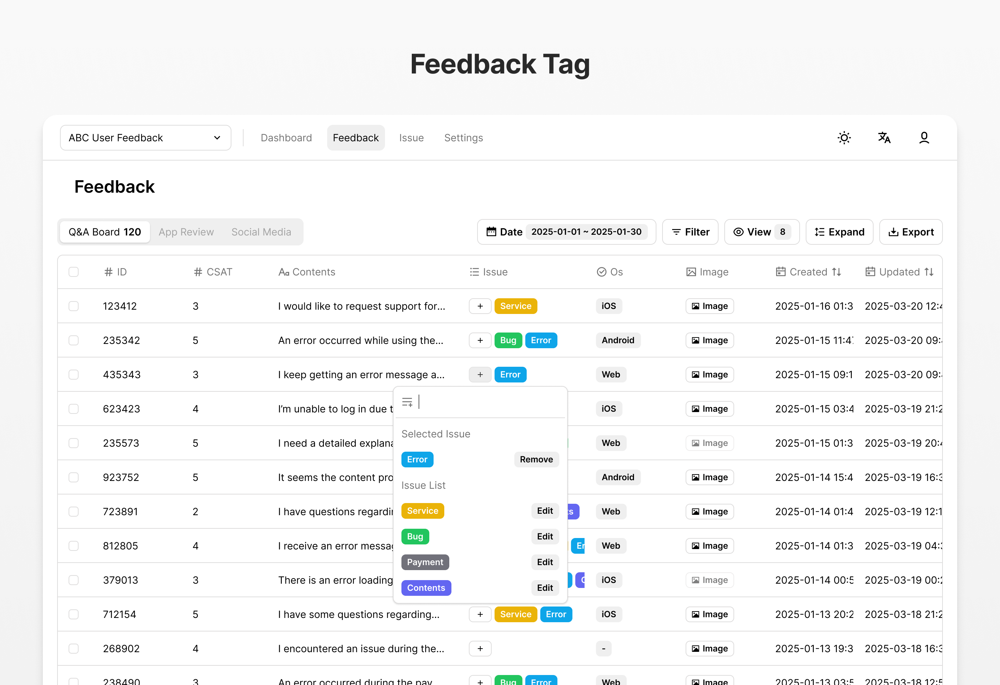
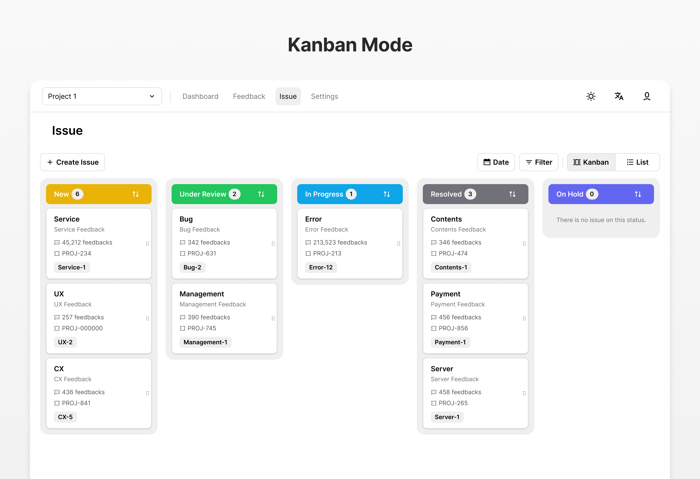
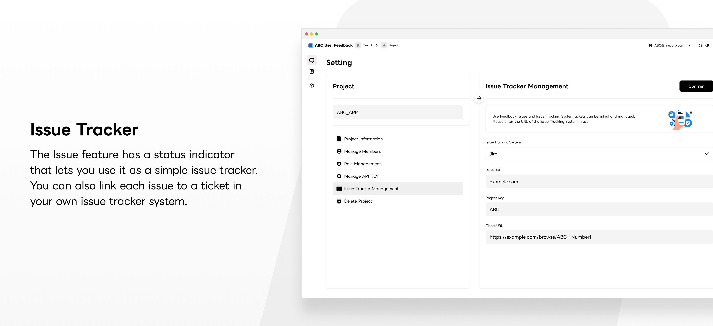
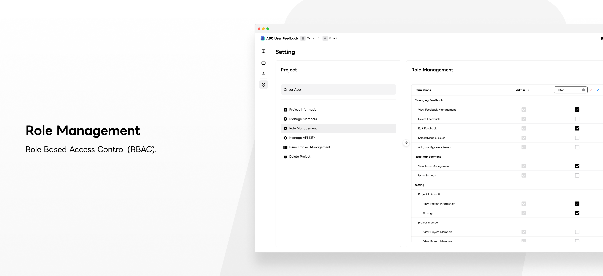
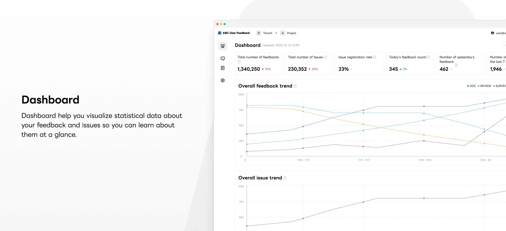
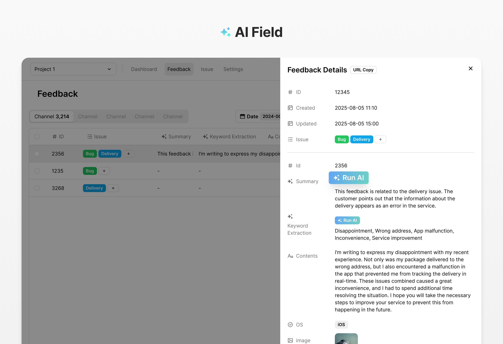
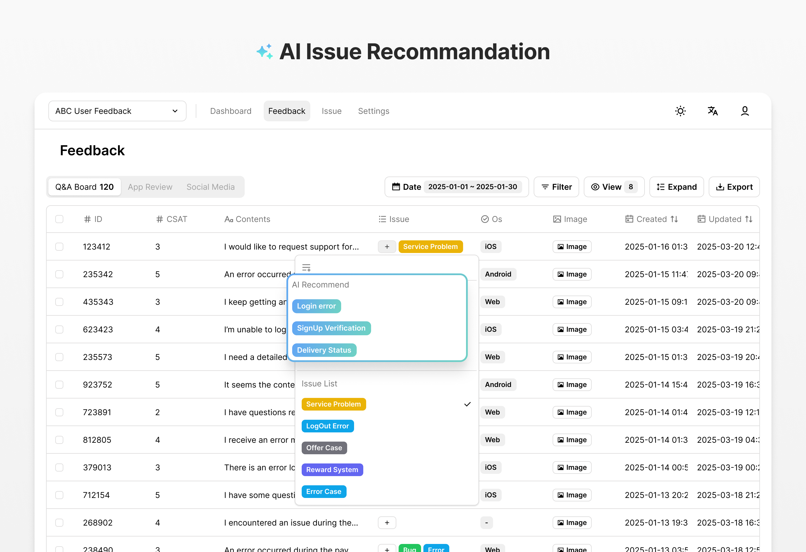

# ABC User Feedback


ABC User Feedback is a standalone web application designed to manage Voice of Customer (VoC) data. It enables you to efficiently gather and categorize customer feedback. The application is currently utilized in services with a reach of 10 million MAU.

<p align="center">
  <video src="https://github.com/user-attachments/assets/a2ef7a1a-41ec-4cec-b7d1-bda5fbd7d48b" width="100%" />
</p>

## ✨ Features

|     |   |
| ------------------------------------------- | ----------------------------------------- |
|    |  |
|  |      |
|         |       |

- **Feedback Tag**: Categorize feedback by topic with customizable tags
- **Kanban Mode**: Visualize and organize issue groups efficiently
- **Issue Tracker**: Simple issue tracking with status indicators and external ticket linking
- **Single Sign-on**: Enterprise-level OAuth authentication
- **Role Management**: Role Based Access Control (RBAC)
- **Dashboard**: Statistical visualization for feedback and issues
- **🤖 AI Field**: AI-powered feedback analysis (summarization, translation, sentiment analysis)
- **🤖 AI Issue Recommendation**: Intelligent issue recommendations based on feedback

## 🚀 Quick Start

Get started with ABC User Feedback in minutes using our CLI tool:

```bash
npx auf-cli init   # initialize infrastructure
npx auf-cli start  # start app
```

That's it! The application will be running with all required infrastructure.

**For detailed installation options**, see our [Installation Guide](https://docs.abc-user-feedback.com/en/developer-guide/installation/docker-hub-images).

## 📚 Documentation

Complete documentation is available at **[https://docs.abc-user-feedback.com/en/](https://docs.abc-user-feedback.com/en/)**

- [Getting Started](https://docs.abc-user-feedback.com/en/user-guide/getting-started) - User guide and tutorials
- [Installation](https://docs.abc-user-feedback.com/en/developer-guide/installation) - Detailed setup instructions
- [API Integration](https://docs.abc-user-feedback.com/en/developer-guide/api-integration) - REST API documentation
- [Configuration](https://docs.abc-user-feedback.com/en/developer-guide/installation/configuration) - Environment variables and settings

## 🐳 Docker Images

Pre-built Docker images are available on Docker Hub:

- **Web Frontend**: `docker pull line/abc-user-feedback-web`
- **API Backend**: `docker pull line/abc-user-feedback-api`

See [Docker Hub Images Guide](https://docs.abc-user-feedback.com/en/developer-guide/installation/docker-hub-images) for usage details.

## 🛠️ Development

For local development setup:

```bash
git clone https://github.com/line/abc-user-feedback
cd abc-user-feedback
pnpm install
pnpm build
pnpm dev
```

See the [Manual Setup](https://docs.abc-user-feedback.com/en/developer-guide/installation/manual-setup) for complete development instructions.

## 🤝 Contributing

We welcome contributions! Please see our [Contributing Guidelines](./CONTRIBUTING.md).

## 📄 License

Copyright 2025 LY Corporation

Licensed under the Apache License, Version 2.0. See [LICENSE](./LICENSE) for details.

---

For questions and support, please visit our [documentation](https://docs.abc-user-feedback.com/en/).
