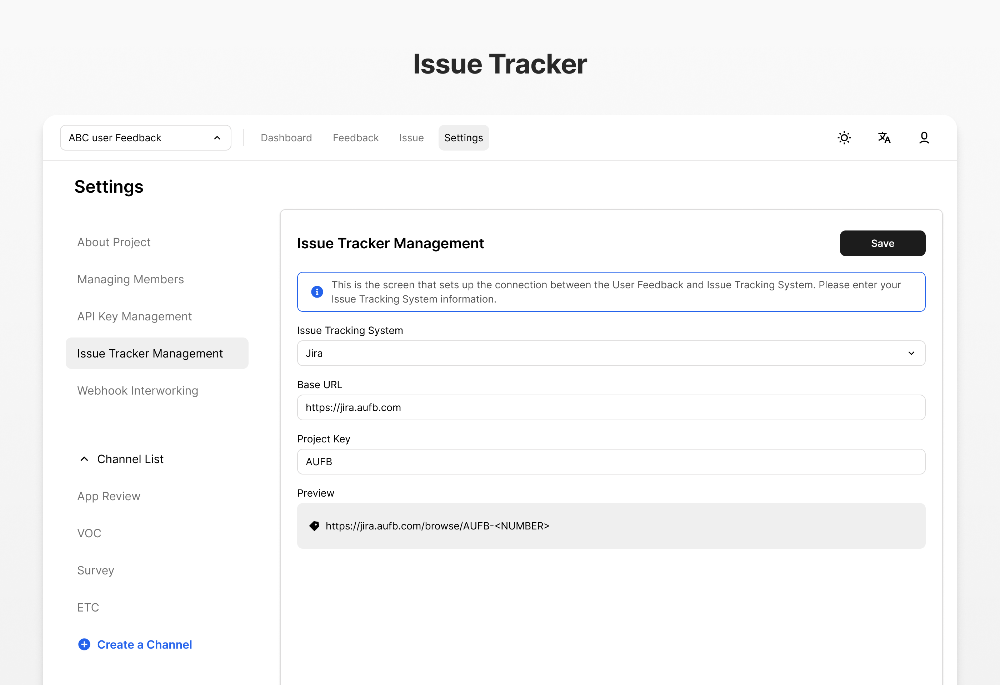
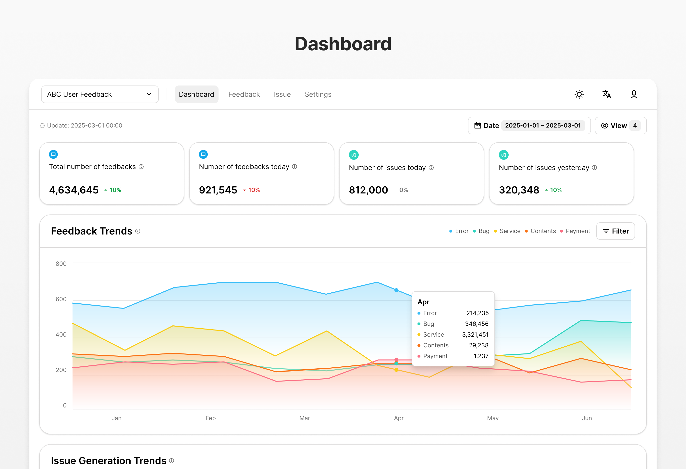

# ABC User Feedback


ABC User Feedback is a standalone web application that manages Voice of Customer (VoC) data. It allows you to gather and sort feedback from your customers. The product is being applied and used in services worth 10 million MAU.


## Features

ABC User Feedback provides the following features:







## Getting Started

The frontend is built with NextJS and the backend is built with NestJS. We provide Docker images for fast and easy setup.

### System Requirements

:bulb: Before you begin, make sure you have the following installed:

**Required**

- [Node.js v18 or above](https://nodejs.org/en/download/)
- [Docker](https://docs.docker.com/desktop/)
- [MySQL v8](https://www.mysql.com/downloads/)

**Optional**

- SMTP - for mail verification during making accounts
- [OpenSearch v7](https://opensearch.org/) - for performance on searching feedback

You can use [docker-compose.infra.yml](/docker/docker-compose.infra.yml) file for requirements.

### Docker Hub Images

We publish two images to https://hub.docker.com at every release.

#### [Web Admin Frontend](https://hub.docker.com/r/line/abc-user-feedback-web)

```bash
docker pull line/abc-user-feedback-web
```

#### [API Backend](https://hub.docker.com/r/line/abc-user-feedback-api)

```bash
docker pull line/abc-user-feedback-api
```

### Configuration

**Frontend**

:point_right: [Go to Frontend README](./apps/web/README.md)

You can configure the frontend for session password, maximum time span to query, etc.

**Backend**

:point_right: [Go to Backend README](./apps/api/README.md)

You can configure the backend for MySQL, SMTP for email verification, OpenSearch-powered improved search experience, etc.

## Setup Dev Environment (Local)

ABC User Feedback is using a monorepo (powered by [TurboRepo](https://turbo.build/)) with multiple apps and packages.

Follow the instructions below to set up a local development environment.

1. Clone the repository and install dependencies:

```bash
git clone https://github.com/line/abc-user-feedback
cd abc-user-feedback
pnpm install
```

2. Spin up all required infrastructure (Mysql, OpenSearch, etc.) using Docker Compose:

```bash
docker-compose -f docker-compose.infra.yml up -d
```

3. Make an `.env` file in `apps/api` and `apps/web` by referring to `.env.example` ([web environment variables](./apps/web/README.md), [api environment variables](./apps/api/README.md))

4. Apply database migrations:

```bash
cd apps/api
npm run migration:run
```

5. To start developing, run the `dev` target of both of apps in root directory:

```bash
pnpm dev
```

6. Also, you can run the `dev` target of one of apps in root directory:

```bash
# web
pnpm turbo run dev --filter=web

# api
pnpm turbo run dev --filter=api
```

### ADMIN WEB GUIDE

For detailed information on using the admin web interface, please refer to our [Admin Web Guide](./GUIDE.md).

### Build Docker Image

For your code build, you can build docker image using docker-compose. Please refer to [remote caching](https://turbo.build/repo/docs/core-concepts/remote-caching) and [deploying with docker](https://turbo.build/repo/docs/handbook/deploying-with-docker) using `turborepo`.

```
docker-compose build
```

Then, run docker-compose

```
docker-compose up -d
```

## Contributing Guidelines

Please follow the [contributing guidelines](./CONTRIBUTING.md) to contribute to the project.

## License

```
Copyright 2023 LINE Corporation

LINE Corporation licenses this file to you under the Apache License,
version 2.0 (the "License"); you may not use this file except in compliance
with the License. You may obtain a copy of the License at:

  https://www.apache.org/licenses/LICENSE-2.0

Unless required by applicable law or agreed to in writing, software
distributed under the License is distributed on an "AS IS" BASIS, WITHOUT
WARRANTIES OR CONDITIONS OF ANY KIND, either express or implied. See the
License for the specific language governing permissions and limitations
under the License.
```

See [LICENSE](./LICENSE) for more details.
