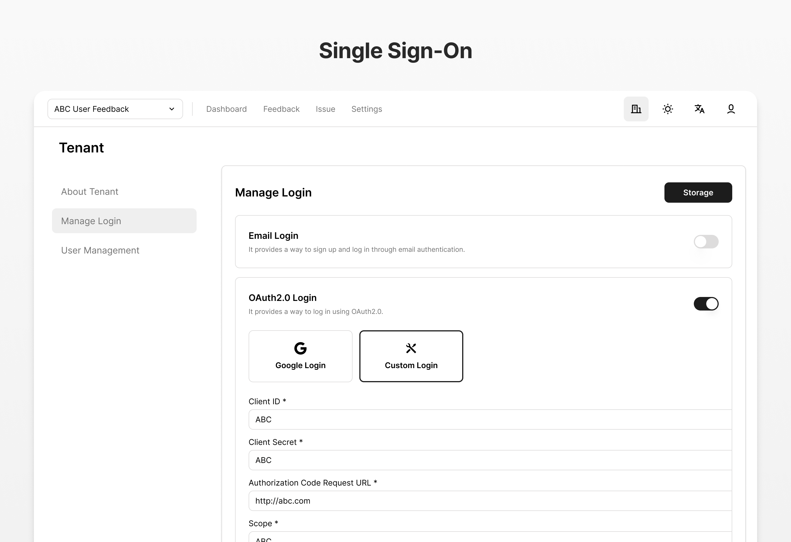
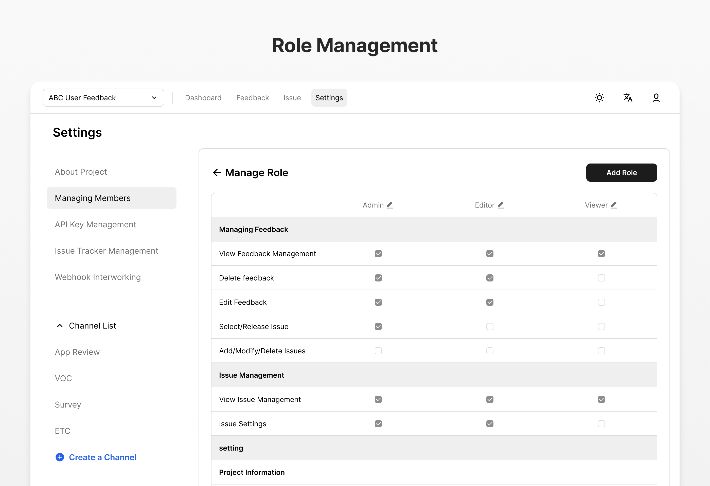

# ABC User Feedback


ABC User Feedback is a standalone web application designed to manage Voice of Customer (VoC) data. It enables you to efficiently gather and categorize customer feedback. The application is currently utilized in services with a reach of 10 million MAU.

## Quick Start

To quickly set up and run the application locally, follow these steps:

1. **Clone the Repository**:

   ```bash
   git clone https://github.com/line/abc-user-feedback
   cd abc-user-feedback
   ```

2. **Install Dependencies**:

   ```bash
   pnpm install
   ```

3. **Start the Application**:
   ```bash
   npx auf-cli init
   npx auf-cli start
   ```

For more detailed setup instructions, refer to the [Getting Started](#getting-started) section.

<p align="center">
  <video src="https://github.com/user-attachments/assets/a2ef7a1a-41ec-4cec-b7d1-bda5fbd7d48b" width="100%" />
</p>

## Table of Contents

- [Features](#-features)
- [Getting Started](#Getting-Started)
- [Configuration](#configuration)
- [Integration](#Integration)
- [Development](#Development)
- [Contributing](#Contributing-Guidelines)
- [License](#license)

## ✨ Features

|     |   |
| ------------------------------------------- | ----------------------------------------- |
|    |  |
|  |      |
|         |       |

- **Feedback Tag**: You can assign tags to each feedback to categorize them by topic.
- **Kanban Mode**: Experience the advantage of organizing and visualizing issue groups efficiently with Kanban mode.
- **Issue Tracker**: The Issue feature has a status indicator that lets you use it as a simple issue tracker. You can also link each issue to a ticket in your own issue tracker system.
- **Single Sign-on**: Authentication offers OAuth to accommodate enterprise-level single sign-on (SSO) requirements.
- **Role Management**: Role Based Access Control (RBAC)
- **Dashboard**: Dashboard help you visualize statistical data about your feedback and issues so you can learn about them at a glance.
- **🤖 AI Field**: Write custom prompts to get AI-powered analysis of your feedback data. Examples include summarization, translation, keyword extraction, and sentiment analysis.
- **🤖 AI Issue Recommandation**: Get intelligent issue recommendations based on feedback analysis using AI-powered insights.

## Getting Started

The frontend is built with Next.js and the backend with NestJS. We provide Docker images for a fast and easy setup.

### System Requirements

Before you begin, ensure you have the following installed:

**Required**:

- [Node.js v22 or above](https://nodejs.org/en/download/)
- [Docker](https://docs.docker.com/desktop/)
- [MySQL v8](https://www.mysql.com/downloads/)

**Optional**:

- SMTP - for mail verification during making accounts
- [OpenSearch v2.16](https://opensearch.org/) - for performance on searching feedback

You can use the [docker-compose.infra-amd64.yml](/docker/docker-compose.infra-amd64.yml) file for requirements.

For ARM architecture, use the [docker-compose.infra-arm64.yml](/docker/docker-compose.infra-arm64.yml) file.

### Docker Hub Images

We publish two images to Docker Hub at every release:

#### [Web Admin Frontend](https://hub.docker.com/r/line/abc-user-feedback-web)

```bash
docker pull line/abc-user-feedback-web
```

#### [API Backend](https://hub.docker.com/r/line/abc-user-feedback-api)

```bash
docker pull line/abc-user-feedback-api
```

## Development

### Setup Dev Environment using Command Line Tool

ABC User Feedback supports a command line tool (`auf-cli`) that easily runs both the frontend and backend.

With this tool, you can initialize the infrastructure and run the app using a pre-configured Docker image. Since the CLI is executable with `npx`, only an `npm` environment is required, with no additional dependencies.

```bash
npx auf-cli init # initialize infrastructure
npx auf-cli start # start app
npx auf-cli stop # stop app
```

Refer to the [npm package site](https://www.npmjs.com/package/auf-cli) for more details.

### Manual Setup (Local)

ABC User Feedback uses a monorepo (powered by [TurboRepo](https://turbo.build/)) with multiple apps and packages.

Follow these instructions to set up a local development environment:

1. **Clone the Repository and Install Dependencies**:

```bash
git clone https://github.com/line/abc-user-feedback
cd abc-user-feedback
pnpm install
```

2. **Spin Up Required Infrastructure** (MySQL, OpenSearch, etc.) using Docker Compose:

```bash
docker-compose -f docker/docker-compose.infra-amd64.yml up -d
```

3. **Create `.env` Files** in `apps/api` and `apps/web` by referring to `.env.example` ([web environment variables](./apps/web/README.md), [api environment variables](./apps/api/README.md)).

4. **Apply Database Migrations**:

```bash
cd apps/api
npm run migration:run
```

5. **Start Developing**: Run the `dev` target of both apps in the root directory:

```bash
pnpm dev
```

### Build Docker Image

For your code build, you can build a Docker image using Docker Compose. Refer to [remote caching](https://turbo.build/repo/docs/core-concepts/remote-caching) and [deploying with Docker](https://turbo.build/repo/docs/handbook/deploying-with-docker) using `turborepo`.

```
docker compose -f docker-compose.yml build
```

Then, run Docker Compose:

```
docker compose -f docker-compose.yml up -d
```

## Configuration

### Frontend

:point_right: [Go to Frontend README](./apps/web/README.md)

You can configure the frontend for session password, maximum time span to query, etc.

### Backend

:point_right: [Go to Backend README](./apps/api/README.md)

You can configure the backend for MySQL, SMTP for email verification, OpenSearch-powered improved search experience, etc.

## Integration

If you want to integrate ABC User Feedback with your service, you can use the following features:

1. RESTful Web API - [API document page](https://line.github.io/abc-user-feedback).
1. Accept images from user - [S3 Integration](./GUIDE.md#image-storage-integration).
1. Webhooks - [Webhook specification](./GUIDE.md#Webhook-Feature).

## Contributing Guidelines

Please follow the [contributing guidelines](./CONTRIBUTING.md) to contribute to the project.

## License

```
Copyright 2025 LY Corporation

LY Corporation licenses this file to you under the Apache License,
version 2.0 (the "License"); you may not use this file except in compliance
with the License. You may obtain a copy of the License at:

  https://www.apache.org/licenses/LICENSE-2.0

Unless required by applicable law or agreed to in writing, software
distributed under the License is distributed on an "AS IS" BASIS, WITHOUT
WARRANTIES OR CONDITIONS OF ANY KIND, either express or implied. See the
License for the specific language governing permissions and limitations
under the License.
```

See [LICENSE](./LICENSE) for more details.
