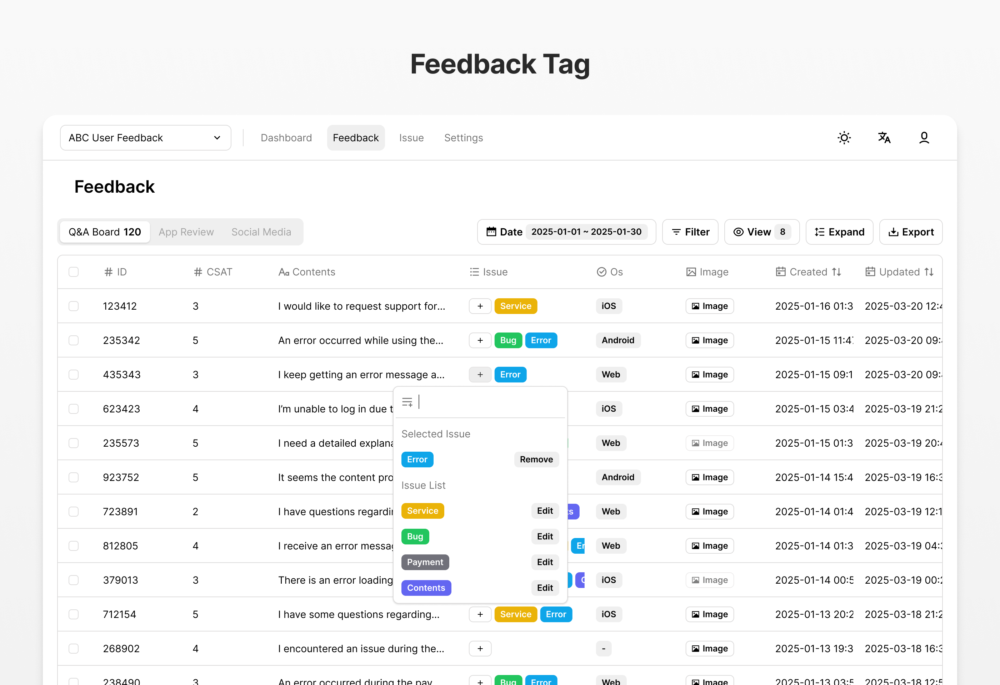
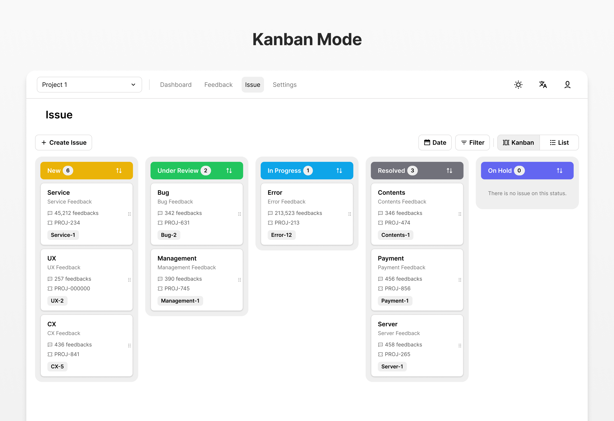

# 주요 기능

ABC User Feedback은 사용자 피드백을 효과적으로 수집, 관리 및 분석하기 위한 다양한 기능을 제공합니다. 이 문서에서는 핵심 기능들을 자세히 설명합니다.

## 피드백 태깅 시스템

피드백 태깅 시스템은 대량의 사용자 피드백을 체계적으로 분류하고 관리하는 핵심 기능입니다.

### 주요 특징

- **다중 이슈 할당**: 각 피드백에 여러 이슈를 할당하여 다차원적 분류 가능
- **커스텀 이슈 생성**: 프로젝트 특성에 맞는 맞춤형 이슈 생성 및 관리
- **이슈 기반 필터링**: 이슈별로 피드백을 필터링하여 특정 주제에 집중
- **이슈 통계**: 이슈 사용 빈도 및 추세 분석을 통한 인사이트 도출
- **이슈 색상 코딩**: 시각적 구분을 위한 이슈별 색상 지정

### 활용 방법

1. 관리자 패널에서 이슈 카테고리 및 이슈 생성
2. 수신된 피드백에 관련 이슈 할당
3. 이슈별 피드백 필터링 및 분석
4. 이슈 사용 패턴을 통한 주요 이슈 및 추세 파악

## 칸반 모드

칸반 모드는 이슈 그룹을 시각적으로 관리하고 워크플로우를 최적화하기 위한 기능입니다.

### 주요 특징

- **직관적인 드래그 앤 드롭**: 이슈 상태 변경을 위한 간편한 인터페이스
- **상태별 열 구성**: 이슈 진행 상태에 따른 열 구분 (예: 할 일, 진행 중, 완료)
- **작업 흐름 시각화**: 팀의 작업 프로세스 및 진행 상황 한눈에 파악
- **작업 부하 관리**: 각 상태별 이슈 수를 통한 작업 부하 모니터링
- **필터 및 정렬**: 다양한 기준으로 칸반 보드 내 이슈 필터링 및 정렬

### 활용 방법

1. 칸반 모드 뷰 선택
2. 상태별 이슈 확인 및 관리
3. 드래그 앤 드롭으로 이슈 상태 변경
4. 팀 작업 흐름 최적화 및 병목 현상 식별

## 이슈 트래커 연동

이슈 트래커 연동은 피드백에서 발견된 문제점이나 개선사항을 체계적으로 관리하기 위한 기능입니다.

### 주요 특징

- **상태 표시기**: 이슈의 현재 상태를 시각적으로 표시 (신규, 진행 중, 해결됨 등)
- **우선순위 설정**: 이슈의 중요도에 따른 우선순위 지정
- **외부 시스템 연동**: 기존 이슈 트래킹 시스템(JIRA, GitHub Issues 등)과 연결 가능
- **담당자 할당**: 이슈 해결을 위한 담당자 지정
- **타임라인 추적**: 이슈 상태 변경 및 코멘트 히스토리 관리

### 활용 방법

1. 피드백에서 이슈 생성 또는 직접 이슈 등록
2. 이슈 세부 정보, 우선순위, 담당자 설정
3. 외부 이슈 트래커와 연결 (선택 사항)
4. 이슈 진행 상황 모니터링 및 업데이트
5. 해결 후 이슈 종료 및 피드백 제공자에게 알림 (선택 사항)

## 싱글 사인온(SSO)

싱글 사인온은 기업 환경에서의 인증 프로세스를 간소화하고 보안을 강화하는 기능입니다.

### 주요 특징

- **OAuth 지원**: 다양한 OAuth 제공자를 통한 인증 지원
- **기업 ID 통합**: 기존 기업 ID 시스템과의 원활한 통합
- **중앙화된 사용자 관리**: 단일 인증 시스템을 통한 사용자 접근 관리
- **보안 강화**: 다중 인증 및 기업 보안 정책 적용 가능
- **간소화된 로그인 경험**: 사용자를 위한 추가 계정 생성 불필요

### 지원하는 SSO 제공자

- Google
- Custom (표준 OAuth 2.0 및 OpenID Connect 제공자)

### 활용 방법

1. 관리자 설정에서 SSO 제공자 구성
2. 인증 파라미터 및 리디렉션 URL 설정
3. 사용자 속성 매핑 구성
4. SSO 로그인 활성화 및 테스트

## 역할 기반 접근 제어(RBAC)

역할 기반 접근 제어는 사용자의 권한을 효과적으로 관리하고 시스템 보안을 유지하는 기능입니다.

### 주요 특징

- **사전 정의된 역할**: 관리자, 분석가, 뷰어 등 기본 역할 제공
- **커스텀 역할 생성**: 조직 구조에 맞는 맞춤형 역할 및 권한 설정
- **세분화된 권한 제어**: 기능별, 데이터별 접근 권한 설정
- **역할 할당 관리**: 사용자별 역할 할당 및 변경
- **권한 상속**: 계층적 권한 구조 지원

### 기본 제공 역할

1. **시스템 관리자**: 모든 기능 및 설정에 대한 완전한 접근 권한
2. **프로젝트 관리자**: 특정 프로젝트 내의 모든 기능 관리 권한
3. **분석가**: 피드백 조회, 분석, 이슈 지정 권한
4. **이슈 관리자**: 이슈 생성, 수정, 상태 변경 권한
5. **뷰어**: 피드백 및 대시보드 조회만 가능한 제한된 권한

### 활용 방법

1. 관리자 패널에서 역할 관리 메뉴 접근
2. 필요에 따라 새로운 역할 생성 또는 기존 역할 수정
3. 사용자에게 적절한 역할 할당
4. 역할별 권한 및 접근 범위 정기적 검토

## 대시보드

대시보드는 피드백 데이터를 시각화하여 중요한 인사이트를 한눈에 파악할 수 있게 해주는 기능입니다.

### 주요 특징

- **실시간 통계**: 피드백 수, 이슈 상태, 해결률 등 주요 지표 실시간 표시
- **추세 분석**: 시간에 따른 피드백 및 이슈 추세 그래프
- **이슈 분포**: 이슈별 피드백 분포 시각화
- **감정 분석**: 피드백의 긍정/부정/중립 감정 분석 (선택 기능)
- **커스텀 대시보드**: 사용자별 맞춤형 대시보드 구성 가능

### 제공되는 차트 및 위젯

1. **피드백 요약 카드**: 총 피드백 수, 신규 피드백, 처리된 피드백 등 주요 지표
2. **시계열 그래프**: 일별/주별/월별 피드백 추세
3. **이슈 클라우드**: 자주 사용되는 이슈 시각화
4. **이슈 상태 도넛 차트**: 이슈 상태별 분포
5. **최근 피드백 목록**: 최신 피드백 빠른 확인
6. **성과 지표**: 응답 시간, 해결 시간 등의 성과 측정 지표

### 활용 방법

1. 대시보드 페이지 접속
2. 기간 및 필터 설정을 통한 데이터 범위 조정
3. 주요 지표 및 추세 분석
4. 인사이트 기반 의사결정 및 액션 아이템 도출
5. 필요시 상세 보고서 내보내기

## 추가 기능

ABC User Feedback은 위에서 설명한 주요 기능 외에도 다음과 같은 추가 기능을 제공합니다:

### API 통합

- RESTful API를 통한 외부 시스템 연동
- 프로그래매틱 피드백 수집 및 관리

### 웹훅

- 주요 이벤트 발생 시 외부 시스템에 알림
- 자동화된 워크플로우 구축 지원

### 이미지 저장 통합

- S3 호환 스토리지를 통한 사용자 제출 이미지 관리
- 피드백에 스크린샷 및 이미지 첨부 기능

### 데이터 내보내기

- CSV, Excel 형식으로 피드백 데이터 내보내기
- 맞춤형 보고서 생성

### 다국어 지원

- 다양한 언어로 인터페이스 제공
- 국제적 팀을 위한 다국어 피드백 관리

---

이 문서는 ABC User Feedback의 주요 기능을 개괄적으로 설명합니다. 각 기능에 대한 더 자세한 사용법은 [사용자 가이드](/docs/category/사용자-가이드) 섹션을 참조하세요.
