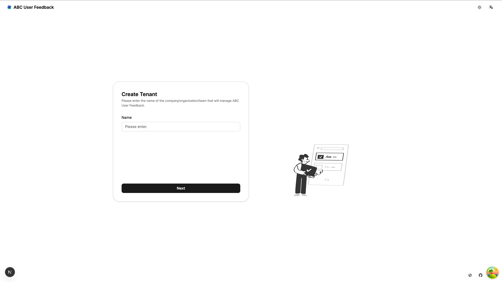

# 빠른 시작 튜토리얼

이 튜토리얼은 ABC User Feedback을 빠르게 설치하고 기본 기능을 사용해보는 방법을 안내합니다. 10분 안에 피드백 수집부터 관리까지 핵심 기능을 경험할 수 있습니다.

## 사전 요구사항

시작하기 전에 다음 요구사항을 충족하는지 확인하세요:

- [Node.js v22 이상](https://nodejs.org/en/download/)
- [Docker](https://docs.docker.com/desktop/)

## 1. CLI 도구를 사용한 빠른 설치

ABC User Feedback은 CLI 도구를 통해 쉽게 설치할 수 있습니다. 이 도구는 필요한 인프라를 자동으로 설정하고 애플리케이션을 시작합니다.

### 인프라 초기화

터미널을 열고 다음 명령을 실행합니다:

```bash
npx auf-cli init
```

이 명령은 다음 작업을 수행합니다:

- 시스템 아키텍처(ARM/AMD)를 감지하고 적절한 Docker 이미지를 선택합니다.
- MySQL, SMTP, OpenSearch 등 필요한 인프라 컨테이너를 설정합니다.
- 환경 변수 구성을 위한 `config.toml` 파일을 생성합니다.

### 서버 시작

다음 명령을 실행하여 API 및 웹 서버를 시작합니다:

```bash
npx auf-cli start
```

서버가 성공적으로 시작되면 웹 브라우저에서 `http://localhost:3000`으로 접속하여 ABC User Feedback 웹 인터페이스에 액세스할 수 있습니다.

## 2. 테넌트 및 관리자 계정 생성

### 테넌트 생성

1. 웹 브라우저에서 `http://localhost:3000`에 접속합니다.
2. 테넌트 생성 화면에서 조직 이름을 입력하고 "Next" 버튼을 클릭합니다.



### 관리자 계정 설정

1. 이메일 주소를 입력하고 "Request Code" 버튼을 클릭합니다.
2. SMTP 서버에서 인증 코드를 확인합니다. (로컬 설치의 경우 `http://localhost:5080`에서 확인 가능)
3. 인증 코드를 입력하고 비밀번호를 설정한 후 "Next" 버튼을 클릭합니다.
4. 테넌트 생성이 완료되면 "Confirm" 버튼을 클릭합니다.
5. 생성한 계정으로 로그인합니다.

## 3. 첫 번째 프로젝트 생성

1. 환영 화면에서 "Next" 버튼을 클릭합니다.
2. 프로젝트 정보 화면에서:
   - 프로젝트 이름: "Quick Start Project"
   - 설명: "My first feedback project"
   - 시간대: 원하는 시간대 선택
3. "Next" 버튼을 클릭합니다.
4. 멤버 관리 화면에서 "Next" 버튼을 클릭합니다. (나중에 멤버를 추가할 수 있습니다)
5. API 키 관리 화면에서 "Create API Key" 버튼을 클릭하여 API 키를 생성합니다.
6. 생성된 API 키를 안전한 곳에 복사해 두고 "Complete" 버튼을 클릭합니다.

## 4. 첫 번째 채널 생성

1. 프로젝트 생성 완료 화면에서 "Create Channel" 버튼을 클릭합니다.
2. 채널 정보 화면에서:
   - 채널 이름: "Web Feedback"
   - 설명: "Feedback from our website"
3. "Next" 버튼을 클릭합니다.
4. 필드 관리 화면에서 기본 필드를 확인하고 "Add Field" 버튼을 클릭하여 새 필드를 추가합니다:
   - Key: "userEmail"
   - Display Name: "User Email"
   - Format: "TEXT"
   - Property: "EDITABLE"
   - Status: "ACTIVE"
5. "Complete" 버튼을 클릭하여 채널 생성을 완료합니다.
6. "Start" 버튼을 클릭하여 대시보드로 이동합니다.

## 5. 첫 번째 피드백 수집하기

### API를 통한 피드백 수집

API를 통해 첫 번째 피드백을 수집해 보겠습니다. 터미널에서 다음 명령을 실행합니다:

```bash
curl -X POST http://localhost:4000/api/v1/projects/1/channels/1/feedbacks \
  -H "Content-Type: application/json" \
  -H "X-API-KEY: YOUR_API_KEY" \
  -d '{
    "content": "이 제품은 정말 좋아요! 하지만 로딩 속도가 조금 느립니다.",
    "userEmail": "user@example.com"
  }'
```

`YOUR_API_KEY`를 앞서 생성한 API 키로 대체하세요.

### 웹 인터페이스에서 피드백 확인

1. 웹 인터페이스의 왼쪽 메뉴에서 "Feedback" 탭을 클릭합니다.
2. 방금 추가한 피드백이 목록에 표시됩니다.
3. 피드백을 클릭하여 상세 내용을 확인합니다.

<!--  -->

## 6. 이슈 추가하기

1. 피드백 상세 화면에서 "Add Tag" 버튼을 클릭합니다.
2. "New Tag" 버튼을 클릭하여 새 이슈를 생성합니다:
   - 카테고리: "Feedback Type" (없으면 새로 생성)
   - 이슈 이름: "Praise"
   - 색상: 원하는 색상 선택
3. "Create" 버튼을 클릭하여 이슈를 생성합니다.
4. 생성한 이슈를 선택하고 "Add" 버튼을 클릭하여 피드백에 이슈를 추가합니다.

<!--  -->

## 7. 이슈 생성하기

1. 피드백 상세 화면에서 "Convert to Issue" 버튼을 클릭합니다.
2. 이슈 정보를 입력합니다:
   - 이슈 이름: "Performance Improvement"
   - 설명: "Need to improve loading speed"
   - 상태: "INIT" (초기 상태)
3. "Create" 버튼을 클릭하여 이슈를 생성합니다.
4. 왼쪽 메뉴에서 "Issues" 탭을 클릭하여 생성된 이슈를 확인합니다.

<!--  -->

## 8. 대시보드 확인하기

1. 왼쪽 메뉴에서 "Dashboard" 탭을 클릭합니다.
2. 피드백 및 이슈 통계가 표시된 대시보드를 확인합니다.
3. 날짜 범위를 조정하여 다른 기간의 데이터를 확인할 수 있습니다.

<!--  -->

## 다음 단계

축하합니다! 이제 ABC User Feedback의 기본 기능을 경험해 보셨습니다. 더 많은 기능을 탐색하려면 다음 문서를 참조하세요:

- [피드백 관리](../03-user-guide/02-feedback-management/01-viewing-filtering.md): 피드백 필터링, 이슈 지정 등 고급 관리 방법
- [이슈 트래커 사용법](../03-user-guide/03-issue-management/01-issue-tracker.md): 칸반 보드를 통한 이슈 관리
- [API 개요](../04-integration-guide/01-api-overview.md): 프로그래매틱 통합을 위한 API 사용법
- [웹훅 설정](../04-integration-guide/03-webhooks.md): 외부 시스템과의 연동

## 문제 해결

설치 또는 사용 중 문제가 발생하면 다음 명령으로 서버를 중지하고 다시 시작해 보세요:

```bash
npx auf-cli stop
npx auf-cli start
```
