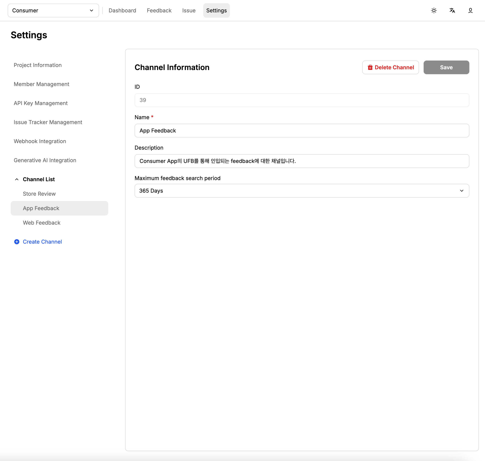

# API 연동

## 개요

ABC User Feedback은 API를 통해 피드백 생성, 수정, 이슈 연결 및 이슈 관리 기능을 제공합니다. 이 문서에서는 주요 API 경로와 사용 방법을 안내합니다.

[API Docs](https://line.github.io/abc-user-feedback/)

## 프로젝트 ID 및 채널 ID 확인

### 프로젝트 ID 확인

Admin Web에 접속하여 다음 단계를 따라 프로젝트 ID를 확인할 수 있습니다:

1. **Admin Web 로그인** 후 좌측 메뉴에서 **Settings** 클릭
2. **Project Information** 메뉴 선택
3. 화면 상단에 표시된 **Project ID** 값을 확인


> 💡 **참고**: Project ID는 숫자 형태로 표시되며, API 호출 시 `{projectId}` 파라미터로 사용됩니다.

### 채널 ID 확인

채널 ID를 확인하려면 다음 단계를 따르세요:

1. **Settings** 메뉴에서 **Channel** 선택
2. **Channel Information** 메뉴 클릭
3. 화면에서 **Channel ID** 값을 확인



> 💡 **참고**: Channel ID도 숫자 형태로 표시되며, API 호출 시 `{channelId}` 파라미터로 사용됩니다.

### 프로젝트 정보 조회

`GET /api/projects/{projectId}`

- 프로젝트의 기본 정보를 조회할 수 있습니다.

```bash
curl --request GET {API_ENDPOINT}/api/projects/{PROJECT_ID} \
--header 'x-api-key: {API_KEY}'
```

## API Key 획득하기 및 인증

Admin Web에 접속하여 Settings > API Key Management 메뉴 에서 API Key를 발급하여 사용할 수 있습니다.


모든 API 요청은 헤더에 `x-api-key`를 포함해야 합니다.

```bash
-H "x-api-key: YOUR_API_KEY"
```

## Field 확인하기

Admin Web에 접속하여 Settings > Channel > Field Management 메뉴에서 현재 Channel에 등록된 필드들을 확인할 수 있으며, 이 정보들을 바탕으로 피드백 생성/수정시 필드에 대한 정보를 parameter로 설정할 수 있습니다.


### 필드 정보 조회

`GET /api/projects/{projectId}/channels/{channelId}/fields`

- 채널에 등록된 활성화된 필드들의 정보를 조회할 수 있습니다.

```bash
curl --request GET {API_ENDPOINT}/api/projects/{PROJECT_ID}/channels/{CHANNEL_ID}/fields \
--header 'x-api-key: {API_KEY}'
```

## 피드백 생성

### JSON 데이터로 피드백 생성

`POST /api/projects/{projectId}/channels/{channelId}/feedbacks`

- Field에 대한 key, value가 json 데이터의 key, value로 들어갑니다.
- 피드백 본문 및 이슈 이름(`issueNames`) 배열을 포함한 JSON 데이터로 피드백을 생성할 수 있습니다.
  - 존재하지 않는 이슈 이름일 경우 이슈를 새로 생성한 후 해당 피드백과 연결시킵니다.
- 이미지 URL 목록도 포함할 수 있습니다.

다음은 피드백 생성 API에 대한 curl 예시입니다. [Field 확인하기](#field-확인하기)에서 획득한 프로젝트 아이디, 채널 아이디 및 API Key를 함께 입력해주세요.

```json
curl --request POST {API_ENDPOINT}/api/projects/{PROJECT_ID}/channels/{CHANNEL_ID}/feedbacks \
--header 'Content-Type: application/json' \
--header 'x-api-key: {API_KEY}' \
--data-raw '{
  "message": "The content of feedback",
  "issueNames": ["issue name 1", "issue name 2"],
  "image": ["https://test.com/image.jpg"]
}'
```

### 이미지 파일과 함께 피드백 생성

`POST /api/projects/{projectId}/channels/{channelId}/feedbacks-with-images`

- multipart form data로 이미지 파일을 함께 업로드할 수 있습니다. 이 경우에는 이미지가 설정한 저장소에 저장이 되게 되는데, 자세한 내용은 [이미지 저장소 연동](/docs/integration-guide/image-storage) 페이지를 참조해 주세요.

## 피드백 조회 및 검색

### 피드백 개별 조회

`GET /api/projects/{projectId}/channels/{channelId}/feedbacks/{feedbackId}`

- 특정 피드백의 상세 정보를 조회할 수 있습니다.

```bash
curl --request GET {API_ENDPOINT}/api/projects/{PROJECT_ID}/channels/{CHANNEL_ID}/feedbacks/{FEEDBACK_ID} \
--header 'x-api-key: {API_KEY}'
```

### 피드백 검색 (V1)

`POST /api/projects/{projectId}/channels/{channelId}/feedbacks/search`

- 다양한 필터(작성일, 수정일, 검색어 등)를 사용하여 피드백을 검색할 수 있습니다.

다음은 피드백 검색에 대한 curl 예시입니다

```json
curl --request POST {API_ENDPOINT}/api/projects/{PROJECT_ID}/channels/{CHANNEL_ID}/feedbacks/search' \
--header 'Content-Type: application/json' \
--header 'x-api-key: {API_KEY}' \
--data-raw '{
  "limit": 10,
  "page": 1,
  "query": {
    "message": "searchText",
    "createdAt": {
      "gte": "2024-01-01",
      "lt": "2026-12-31"
    }
  },
  "sort": {
    "createdAt": "ASC"
  }
}'
```

### 피드백 검색 (V2)

`POST /api/v2/projects/{projectId}/channels/{channelId}/feedbacks/search`

- 향상된 검색 기능을 제공하는 V2 API입니다. 더 정교한 필터링과 검색 옵션을 지원합니다.
- `queries` 배열을 사용하여 복잡한 검색 조건을 구성할 수 있습니다.
- `operator`를 통해 쿼리들을 'AND' 또는 'OR'로 연결할 수 있습니다.

```json
curl --request POST {API_ENDPOINT}/api/v2/projects/{PROJECT_ID}/channels/{CHANNEL_ID}/feedbacks/search' \
--header 'Content-Type: application/json' \
--header 'x-api-key: {API_KEY}' \
--data-raw '{
  "limit": 10,
  "page": 1,
  "queries": [
    {
      "key": "message",
      "value": "searchText",
      "condition": "CONTAINS"
    },
    {
      "key": "createdAt",
      "value": {
        "gte": "2024-01-01",
        "lt": "2026-12-31"
      },
      "condition": "BETWEEN"
    }
  ],
  "operator": "AND",
  "sort": {
    "createdAt": "ASC"
  }
}'
```

### 키워드 기반 피드백 조회

`GET /api/projects/{projectId}/channels/{channelId}/feedbacks`

- 특정 필드 키와 검색어, 또는 이슈 이름을 사용하여 피드백을 조회할 수 있습니다.

```bash
# 필드 키와 검색어로 조회
curl --request GET "{API_ENDPOINT}/api/projects/{PROJECT_ID}/channels/{CHANNEL_ID}/feedbacks?fieldKey=message&searchText=error&page=1&limit=10" \
--header 'x-api-key: {API_KEY}'

# 이슈 이름으로 조회
curl --request GET "{API_ENDPOINT}/api/projects/{PROJECT_ID}/channels/{CHANNEL_ID}/feedbacks?issueName=bug&page=1&limit=10" \
--header 'x-api-key: {API_KEY}'
```

## 피드백 수정

### 피드백 수정

`PUT /api/projects/{projectId}/channels/{channelId}/feedbacks/{feedbackId}`

- 피드백의 편집 가능한 필드만 수정할 수 있습니다.
- 이슈 이름(`issueNames`)을 갱신할 수도 있습니다.

```json
curl --request PUT {API_ENDPOINT}/api/projects/{PROJECT_ID}/channels/{CHANNEL_ID}/feedbacks/{FEEDBACK_ID} \
--header 'Content-Type: application/json' \
--header 'x-api-key: {API_KEY}' \
--data-raw '{
  "message": "updated feedback message",
  "issueNames": ["updated issue name"]
}'
```

### 피드백 다중 삭제

`DELETE /api/projects/{projectId}/channels/{channelId}/feedbacks`

- 여러 피드백을 한 번에 삭제할 수 있습니다.

```json
curl --request DELETE {API_ENDPOINT}/api/projects/{PROJECT_ID}/channels/{CHANNEL_ID}/feedbacks \
--header 'Content-Type: application/json' \
--header 'x-api-key: {API_KEY}' \
--data-raw '{
  "feedbackIds": [1, 2, 3]
}'
```

## 피드백 이슈 연결 및 해제

### 피드백에 이슈 추가

`POST /api/projects/{projectId}/channels/{channelId}/feedbacks/{feedbackId}/issue/{issueId}`

- 특정 피드백에 기존 이슈를 연결합니다.

### 피드백에서 이슈 제거

`DELETE /api/projects/{projectId}/channels/{channelId}/feedbacks/{feedbackId}/issue/{issueId}`

- 특정 피드백에서 연결된 이슈를 제거합니다.

## 이슈 관리

### 이슈 생성

`POST /api/projects/{projectId}/issues`

- 새 이슈를 생성합니다.

```json
{
  "name": "이슈 이름",
  "status": "INIT",
  "description": "이슈 설명",
  "externalIssueId": "외부 시스템 이슈 ID"
}
```

### 이슈 수정

`PUT /api/projects/{projectId}/issues/{issueId}`

- 이슈 이름, 설명, 상태를 수정할 수 있습니다.

### 이슈 개별 조회

`GET /api/projects/{projectId}/issues/{issueId}`

- 특정 이슈의 상세 정보를 조회할 수 있습니다.

```bash
curl --request GET {API_ENDPOINT}/api/projects/{PROJECT_ID}/issues/{ISSUE_ID} \
--header 'x-api-key: {API_KEY}'
```

### 이슈 삭제

`DELETE /api/projects/{projectId}/issues/{issueId}`

- 특정 이슈를 삭제합니다.

```bash
curl --request DELETE {API_ENDPOINT}/api/projects/{PROJECT_ID}/issues/{ISSUE_ID} \
--header 'x-api-key: {API_KEY}'
```

### 이슈 다중 삭제

`DELETE /api/projects/{projectId}/issues`

- 여러 이슈를 한 번에 삭제할 수 있습니다.

```json
curl --request DELETE {API_ENDPOINT}/api/projects/{PROJECT_ID}/issues \
--header 'Content-Type: application/json' \
--header 'x-api-key: {API_KEY}' \
--data-raw '{
  "issueIds": [1, 2, 3]
}'
```

### 이슈 검색

`POST /api/projects/{projectId}/issues/search`

- 프로젝트 내 모든 이슈를 검색할 수 있습니다.

```json
curl --request POST {API_ENDPOINT}/api/projects/{PROJECT_ID}/issues/search \
--header 'Content-Type: application/json' \
--header 'x-api-key: {API_KEY}' \
--data-raw '{
  "limit": 10,
  "page": 1,
  "query": {
    "name": "issue name"
  },
  "sort": {
    "createdAt": "ASC"
  }
}'
```

## 이슈 카테고리 관리

### 이슈에 카테고리 추가

`PUT /api/projects/{projectId}/issues/{issueId}/category/{categoryId}`

- 특정 이슈에 카테고리를 추가합니다.

```bash
curl --request PUT {API_ENDPOINT}/api/projects/{PROJECT_ID}/issues/{ISSUE_ID}/category/{CATEGORY_ID} \
--header 'x-api-key: {API_KEY}'
```

### 이슈에서 카테고리 제거

`DELETE /api/projects/{projectId}/issues/{issueId}/category/{categoryId}`

- 특정 이슈에서 카테고리를 제거합니다.

```bash
curl --request DELETE {API_ENDPOINT}/api/projects/{PROJECT_ID}/issues/{ISSUE_ID}/category/{CATEGORY_ID} \
--header 'x-api-key: {API_KEY}'
```

## 이미지 업로드 URL 생성

### Presigned URL 생성

`GET /api/projects/{projectId}/channels/{channelId}/image-upload-url`

- 이미지 업로드를 위한 presigned URL을 생성합니다. 이 URL을 사용하여 클라이언트에서 직접 S3에 이미지를 업로드할 수 있습니다.

```bash
curl --request GET "{API_ENDPOINT}/api/projects/{PROJECT_ID}/channels/{CHANNEL_ID}/image-upload-url?extension=png" \
--header 'x-api-key: {API_KEY}'
```

> **주의사항**: 이 API를 사용하려면 채널에 S3 이미지 설정이 완료되어 있어야 합니다. 자세한 내용은 [이미지 저장소 연동](/docs/integration-guide/image-storage) 페이지를 참조하세요.

---

이 문서는 ABC User Feedback의 피드백 및 이슈 관리 API 사용 방법을 간략히 정리한 것입니다. 보다 자세한 API 명세는 Swagger 문서(`/docs`)를 참고하세요.
