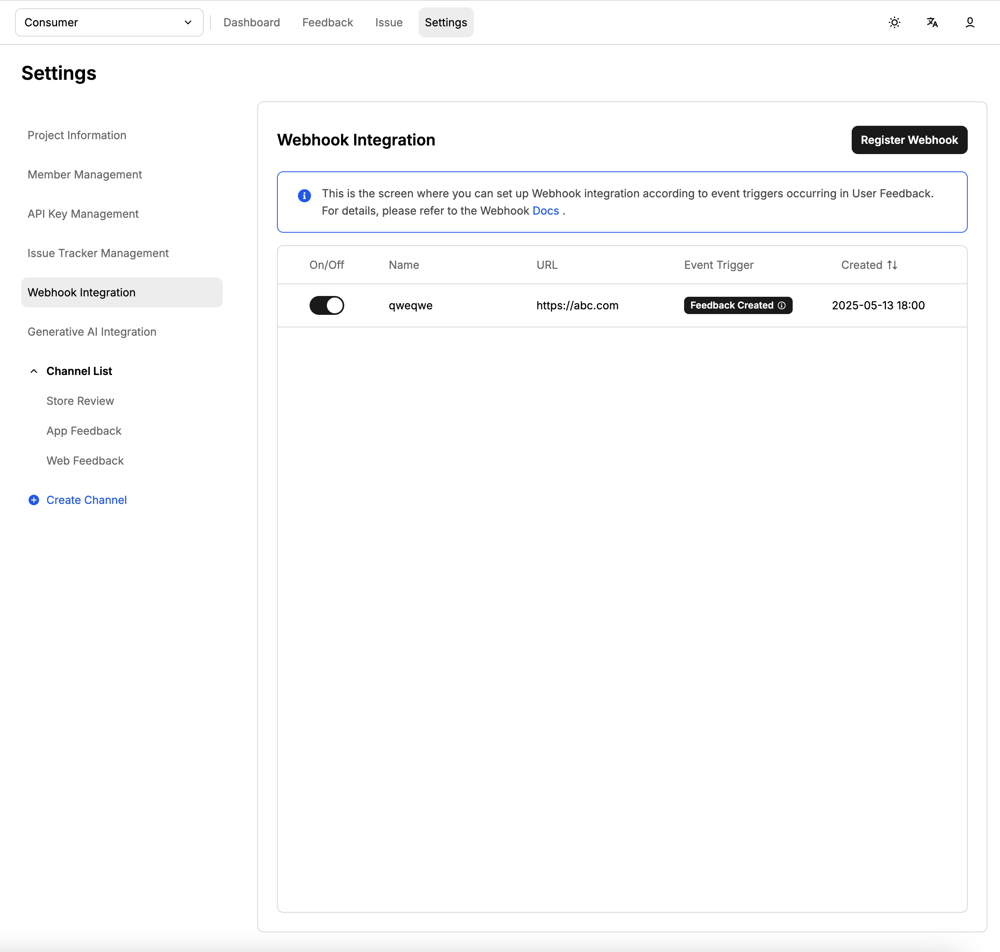

# 웹훅 연동

이 페이지는 ABC User Feedback의 웹훅(Webhook) 기능에 대해 설명합니다.

## 개요

ABC User Feedback은 다양한 이벤트 발생 시 외부 시스템으로 실시간 알림을 전송할 수 있도록 웹훅 기능을 제공합니다. 이를 통해 번역, 감정 분석, 티켓 생성 등의 자동화를 구현할 수 있습니다.

## 주요 내용

### 웹훅 설정 방법

1. 프로젝트 설정 페이지로 이동합니다.
2. 웹훅 URL과 구독할 이벤트를 설정합니다.
3. 저장 후, 이벤트 발생 시 설정된 URL로 POST 요청이 전송됩니다.



> 웹훅 리스너 서버는 JSON POST 요청을 수신할 수 있어야 합니다.

### 지원하는 이벤트 및 실제 페이로드 구조

#### FEEDBACK_CREATION

새 피드백이 생성될 때 발생합니다.

**요청 헤더:**

```
Content-Type: application/json
x-webhook-token: your-secret-token
```

**페이로드 예시:**

```json
{
  "event": "FEEDBACK_CREATION",
  "data": {
    "feedback": {
      "id": 123,
      "createdAt": "2024-01-15T10:30:00.000Z",
      "updatedAt": "2024-01-15T10:30:00.000Z",
      "message": "사용자 피드백 내용",
      "userEmail": "user@example.com",
      "issues": [
        {
          "id": 456,
          "createdAt": "2024-01-15T10:30:00.000Z",
          "updatedAt": "2024-01-15T10:30:00.000Z",
          "name": "버그 리포트",
          "description": "이슈 설명",
          "status": "OPEN",
          "externalIssueId": "EXT-123",
          "feedbackCount": 5
        }
      ]
    },
    "channel": {
      "id": 1,
      "name": "웹사이트 피드백"
    },
    "project": {
      "id": 1,
      "name": "My Project"
    }
  }
}
```

#### ISSUE_ADDITION

피드백에 이슈가 추가될 때 발생합니다.

**페이로드 예시:**

```json
{
  "event": "ISSUE_ADDITION",
  "data": {
    "feedback": {
      "id": 123,
      "createdAt": "2024-01-15T10:30:00.000Z",
      "updatedAt": "2024-01-15T10:30:00.000Z",
      "message": "사용자 피드백 내용",
      "issues": [
        {
          "id": 456,
          "name": "기존 이슈",
          "status": "OPEN"
        },
        {
          "id": 789,
          "name": "새로 추가된 이슈",
          "status": "OPEN"
        }
      ]
    },
    "channel": {
      "id": 1,
      "name": "웹사이트 피드백"
    },
    "project": {
      "id": 1,
      "name": "My Project"
    },
    "addedIssue": {
      "id": 789,
      "createdAt": "2024-01-15T11:00:00.000Z",
      "updatedAt": "2024-01-15T11:00:00.000Z",
      "name": "새로 추가된 이슈",
      "description": "이슈 설명",
      "status": "OPEN",
      "externalIssueId": "EXT-456",
      "feedbackCount": 1
    }
  }
}
```

#### ISSUE_CREATION

새 이슈가 생성될 때 발생합니다.

**페이로드 예시:**

```json
{
  "event": "ISSUE_CREATION",
  "data": {
    "issue": {
      "id": 789,
      "createdAt": "2024-01-15T11:00:00.000Z",
      "updatedAt": "2024-01-15T11:00:00.000Z",
      "name": "새로운 이슈",
      "description": "이슈 설명",
      "status": "OPEN",
      "externalIssueId": "EXT-789",
      "feedbackCount": 0
    },
    "project": {
      "id": 1,
      "name": "My Project"
    }
  }
}
```

#### ISSUE_STATUS_CHANGE

이슈 상태가 변경될 때 발생합니다.

**페이로드 예시:**

```json
{
  "event": "ISSUE_STATUS_CHANGE",
  "data": {
    "issue": {
      "id": 789,
      "createdAt": "2024-01-15T11:00:00.000Z",
      "updatedAt": "2024-01-15T12:00:00.000Z",
      "name": "이슈 이름",
      "description": "이슈 설명",
      "status": "IN_PROGRESS",
      "externalIssueId": "EXT-789",
      "feedbackCount": 3
    },
    "project": {
      "id": 1,
      "name": "My Project"
    },
    "previousStatus": "OPEN"
  }
}
```

### 웹훅 처리 가이드

#### 기본 요구사항

- 수신 서버는 HTTP POST 요청을 처리해야 합니다.
- JSON Payload를 파싱하고, 이벤트 종류에 따라 적절한 후처리를 수행할 수 있습니다.
- HTTP 200 상태 코드로 응답해야 합니다.

#### 웹훅 리스너 서버 예시 (Node.js/Express)

```javascript
const express = require('express');
const app = express();

app.use(express.json());

app.post('/webhook', (req, res) => {
  const { event, data } = req.body;
  const token = req.headers['x-webhook-token'];

  // 토큰 검증
  if (token !== 'your-secret-token') {
    return res.status(401).json({ error: 'Unauthorized' });
  }

  // 이벤트 처리
  switch (event) {
    case 'FEEDBACK_CREATION':
      console.log('새 피드백 생성:', data.feedback);
      // 피드백 처리 로직
      break;
    case 'ISSUE_CREATION':
      console.log('새 이슈 생성:', data.issue);
      // 이슈 처리 로직
      break;
    case 'ISSUE_STATUS_CHANGE':
      console.log(
        '이슈 상태 변경:',
        data.issue,
        '이전 상태:',
        data.previousStatus,
      );
      // 상태 변경 처리 로직
      break;
    case 'ISSUE_ADDITION':
      console.log('이슈 추가:', data.addedIssue);
      // 이슈 추가 처리 로직
      break;
  }

  res.status(200).json({ success: true });
});

app.listen(3000, () => {
  console.log('웹훅 리스너 서버가 포트 3000에서 실행 중입니다.');
});
```

### 보안 및 재시도 정책

#### 보안 고려사항

- **토큰 검증**: `x-webhook-token` 헤더를 통해 요청을 검증합니다.
- **HTTPS 사용**: 프로덕션 환경에서는 반드시 HTTPS를 사용하세요.
- **IP 화이트리스트**: 가능한 경우 ABC User Feedback 서버의 IP를 화이트리스트에 추가하세요.

#### 재시도 정책

- **자동 재시도**: ABC User Feedback은 웹훅 전송 실패 시 최대 3회까지 자동 재시도합니다.
- **재시도 간격**: 각 재시도는 3초 후에 실행됩니다.
- **타임아웃**: HTTP 요청 타임아웃은 5초입니다.
- **최대 리다이렉트**: 최대 5회까지 리다이렉트를 따릅니다.

#### 에러 처리

- **4xx 에러**: 클라이언트 오류로 간주하여 재시도하지 않습니다.
- **5xx 에러**: 서버 오류로 간주하여 재시도합니다.
- **네트워크 오류**: 연결 실패 시 재시도합니다.

### 웹훅 설정 옵션

#### 웹훅 상태

- `ACTIVE`: 웹훅이 활성화되어 이벤트를 전송합니다.
- `INACTIVE`: 웹훅이 비활성화되어 이벤트를 전송하지 않습니다.

#### 이벤트 상태

- `ACTIVE`: 해당 이벤트 타입에 대해 웹훅을 전송합니다.
- `INACTIVE`: 해당 이벤트 타입에 대해 웹훅을 전송하지 않습니다.

#### 채널 필터링

- `channelIds` 배열을 통해 특정 채널의 이벤트만 구독할 수 있습니다.
- 빈 배열인 경우 모든 채널의 이벤트를 구독합니다.

### 활용 사례

#### 1. 자동 번역

```javascript
// FEEDBACK_CREATION 이벤트를 받아서 자동 번역
if (event === 'FEEDBACK_CREATION') {
  const translatedMessage = await translateText(data.feedback.message);
  // 번역된 내용을 피드백에 업데이트
  await updateFeedback(data.feedback.id, { translatedMessage });
}
```

#### 2. 외부 티켓 시스템 연동

```javascript
// ISSUE_CREATION 이벤트를 받아서 외부 시스템에 티켓 생성
if (event === 'ISSUE_CREATION') {
  const ticketId = await createExternalTicket({
    title: data.issue.name,
    description: data.issue.description,
    priority: 'medium',
  });
  // 외부 티켓 ID를 이슈에 저장
  await updateIssue(data.issue.id, { externalIssueId: ticketId });
}
```

#### 3. 알림 시스템 연동

```javascript
// ISSUE_STATUS_CHANGE 이벤트를 받아서 팀에 알림
if (event === 'ISSUE_STATUS_CHANGE') {
  await sendSlackNotification({
    channel: '#feedback-alerts',
    message: `이슈 "${data.issue.name}"의 상태가 ${data.previousStatus}에서 ${data.issue.status}로 변경되었습니다.`,
  });
}
```

## 추가 정보

- 웹훅과 ABC User Feedback API를 조합하여 피드백 자동 분석, 이슈 자동 업데이트 등 다양한 확장이 가능합니다.
- 자세한 이벤트 별 스펙과 예시는 `/docs` 경로의 Swagger 문서를 참고하세요.
- 웹훅 로그는 시스템 로그에서 확인할 수 있습니다.
